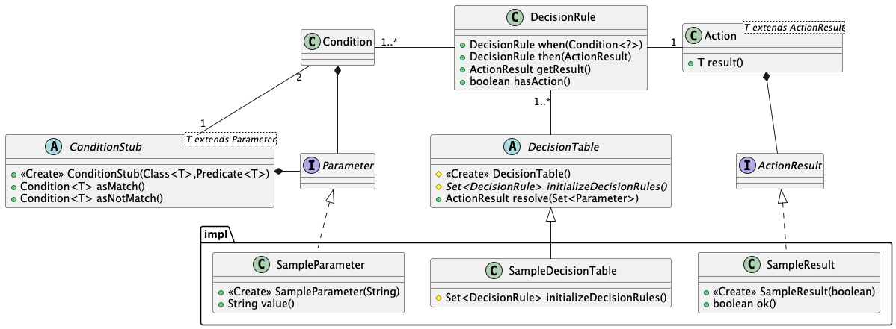
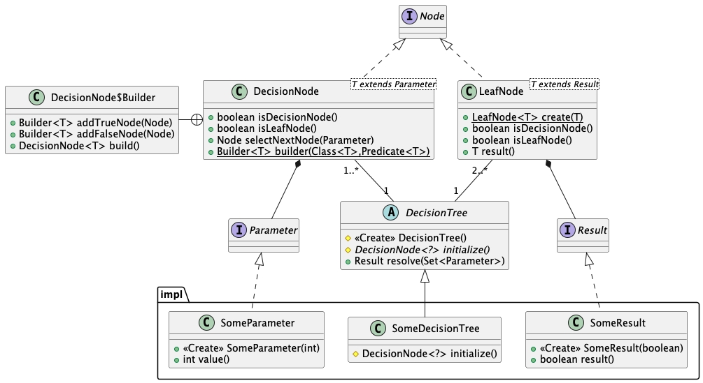
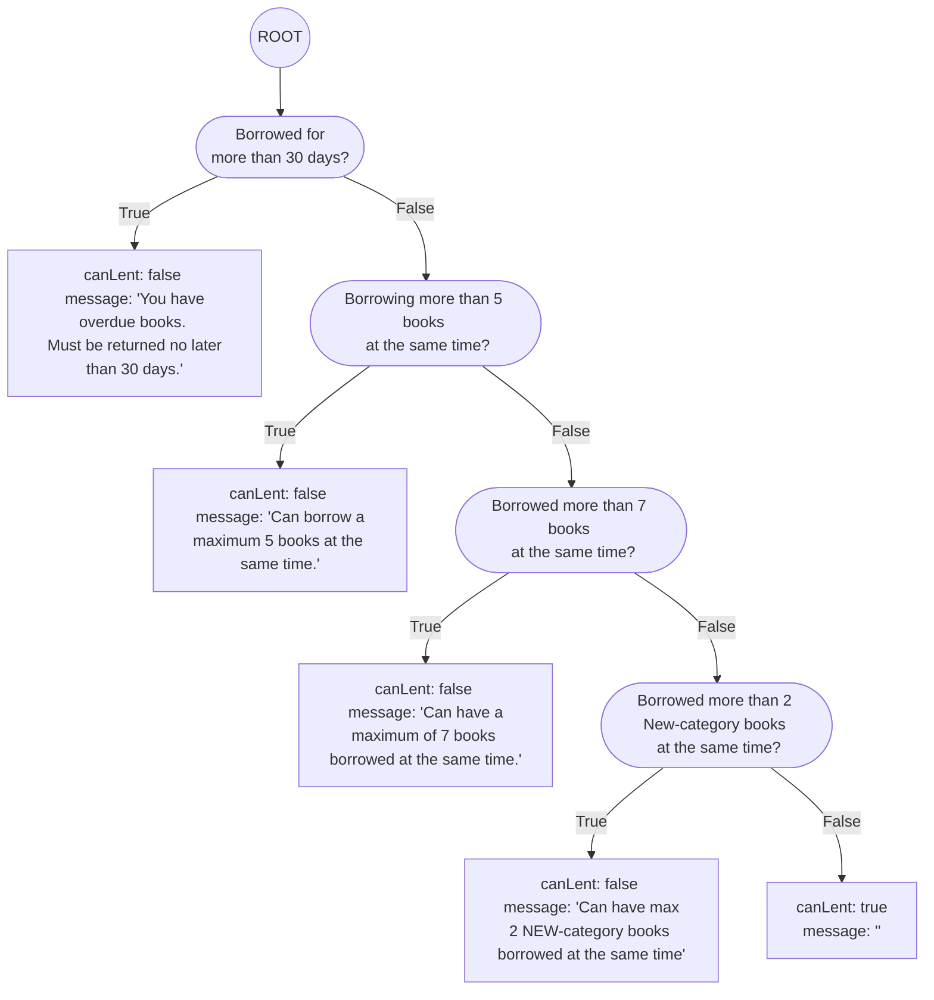
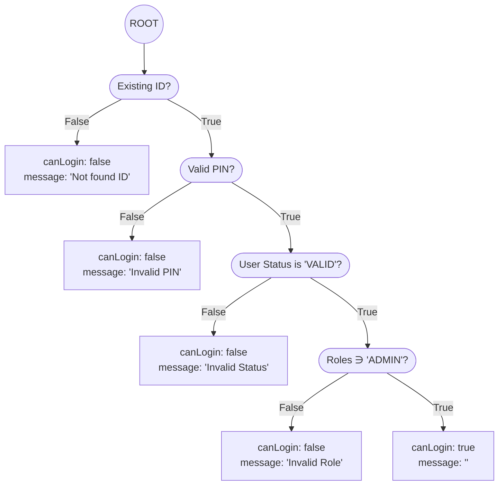

# Decision Table and Decision Tree

## TOC

- [Decision Table](#decision-table)
    - [Overview](#overview)
        - [Class diagram](#class-diagram)
        - [How to implement Decision table](#how-to-implement-decision-table)
        - [How to use implemented Decision table](#how-to-use-implemented-decision-table)
    - [Reference Documentation](#reference-documentation)
- [Decision Tree](#decision-tree)
    - [Overview](#overview-1)
        - [Class diagram](#class-diagram-1)
        - [How to implement Decision tree](#how-to-implement-decision-tree)
        - [How to use implemented Decision tree](#how-to-use-implemented-decision-tree)
    - [Reference Documentation](#reference-documentation-1)
- [Example implementations](#example-implementations)
    - [Booking system for a library (library)](#booking-system-for-a-library-library)
        - [Requirements](#requirements)
        - [Decision table](#decision-table-1)
        - [Decision tree](#decision-tree-1)
    - [Login as Admin (login)](#login-as-admin-login)
        - [Requirements](#requirements-1)
        - [Decision table](#decision-table-2)
        - [Decision tree](#decision-tree-2)

## Decision Table

### Overview

#### Class diagram



#### How to implement Decision table

1. Implement `Parameter.class`
2. Implement `ActionResult.class`
3. Implement the method `initializeDecisionRules()` in a class that inherits from `DecisionTable.class`.
    1. Create instances of `ConditionStub.class` with a class that is implemented `Parameter.class`.
    2. Add rule sets which have the condition entries and the Action entry which represent a result.
4. Pass parameters to the decision table and get the result with 'resolve()'.

#### How to use implemented Decision table

Call `DecisionTable.resolve(java.util.Set<DecisionParameter>)` with passing the parameters that will be checked.

e.g.

```java
import java.util.Arrays;
import java.util.Set;

public class UsingDecisionTable {

    // 1. Implement Parameter.class
    record SomeParameter(int value) implements Parameter {
    }

    // 2. Implemented ActionResult.class
    record SomeActionResult(boolean ok) implements ActionResult {
    }

    // 3. Implement the method initializeDecisionRules() in a class that inherits from DecisionTable.class.
    static public class SomeDecisionTable extends DecisionTable {
        @Override
        protected Set<DecisionRule> initializeDecisionRules() {
            // 3-1. Create instances of ConditionStub.class with a class that is implemented Parameter.class
            var condition = new ConditionStub<>(SomeParameter.class, (p) -> p.value() < 10);

            // 3-2. Added rule sets which have the condition entries and the Action entry which represent a result.
            return Set.of(
                    new DecisionRule()
                            .when(condition.asMatch())
                            .then(new SomeActionResult(true)),
                    new DecisionRule()
                            .when(condition.asNotMatch())
                            .then(new SomeActionResult(false)));
        }
    }

    public static void main(String[] args) {
        var decisionTable = new SomeDecisionTable();
        int[] params = {5, 9, 11, 15};
        Arrays.stream(params).forEach(p -> {
            // 4. Pass parameters to the decision table and get the result with 'resolve()'.
            var result = decisionTable.resolve(Set.of(new SomeParameter(p)));
            System.out.println("Result: " + result);
        });
    }
}
```

### Reference Documentation

* [Decision table](https://en.wikipedia.org/wiki/Decision_table)
* [A guide to Using Decision Tables](https://reqtest.com/en/knowledgebase/a-guide-to-using-decision-tables/)
* [Decision Tables](http://www.bawiki.com/wiki/Decision-Table.html)

## Decision Tree

### Overview

#### Class diagram



#### How to implement Decision tree

1. Implement `Parameter.class`
2. Implement `Result.class`
3. Implement the method `initialize()` in a class that inherits from `DecisionTree.class`.
    1. Create nodes tree. Each Decision Node has both 'true node' and 'false node'.
4. Pass parameters to the decision tree and get the result with 'resolve()'.

#### How to use implemented Decision tree

Call `DecisionTree.resolve(java.util.Set<DecisionParameter>)` with passing the parameters that will be checked.

e.g.

```java
import java.util.Arrays;
import java.util.Set;

public class UsingDecisionTree {

    // 1. Implement Parameter.class
    record SomeStringParameter(String value) implements Parameter {
    }

    record SomeNumberParameter(int value) implements Parameter {
    }

    // 2. Implemented Result.class
    record SomeResult(boolean ok) implements Result {
    }

    // 3. Implement the method initialize() in a class that inherits from DecisionTree.class.
    static public class SomeDecisionTree extends DecisionTree {
        @Override
        protected DecisionNode<?> initialize() {
            // 3-1. Create nodes tree. Each Decision Node has true node and false node
            return DecisionNode.builder(SomeStringParameter.class, (p) -> p.value().equals("CORRECT_STRING"))
                    .addFalseNode(LeafNode.create(new SomeResult(false)))
                    .addTrueNode(DecisionNode.builder(SomeNumberParameter.class, (p) -> p.value() < 10)
                            .addTrueNode(LeafNode.create(new SomeResult(true)))
                            .addFalseNode(LeafNode.create(new SomeResult(false)))
                            .build())
                    .build();
        }
    }

    public static void main(String[] args) {
        var decisionTree = new SomeDecisionTree();
        String[] strParams = {"CORRECT_STRING", "INCORRECT_STRING"};
        int[] numParams = {5, 9, 11, 15};
        Arrays.stream(strParams).forEach(str ->
                Arrays.stream(numParams).forEach(num -> {
                    // Pass parameter to the decision tree and get the result
                    var result = decisionTree.resolve(Set.of(new SomeStringParameter(str), new SomeNumberParameter(num)));
                    System.out.printf("strPram: %s, numPram: %d --> Result: %s\n", str, num, result.toString());
                }));
    }
}
```

### Reference Documentation

* [Decision tree](https://en.wikipedia.org/wiki/Decision_tree)

## Example implementations

### Booking system for a library (library)

#### Requirements

We want to create a booking system for a library, where customers can borrow books for a limited time.

- All articles in the library are categorized as NEW, CLASSIC, STANDARD
- As a customer you can borrow a maximum 5 articles at the same time (of borrowing)
- All articles must be returned no later than 30 days after the time of borrowing
- One customer can have a maximum of 7 articles borrowed at the same time, but a maximum of 2 NEW-articles

#### Decision table

- [com.example.decisiontable.impl.library](https://gitlab.com/lwing/decisiontable/-/tree/master/src/main/java/com/example/decisiontable/impl/library)

| Stubs                                                     | R1 | R2                                                            | R3                                                         | R4                                               | ELSE                                                              |
|-----------------------------------------------------------|----|---------------------------------------------------------------|------------------------------------------------------------|--------------------------------------------------|-------------------------------------------------------------------|
| ***IF (Condition stub)***                                 |    |                                                               |                                                            |                                                  |                                                                   |
| Borrowed for more than 30 days?                           | N  | N                                                             | N                                                          | N                                                | Y                                                                 |
| Borrowing more than 5 books at the same time?             | Y  | Y                                                             | Y                                                          | N                                                | I                                                                 |
| Borrowed more than 7 books at the same time?              | Y  | Y                                                             | N                                                          | I                                                | I                                                                 |
| Borrowed more than 2 New-category books at the same time? | Y  | N                                                             | I                                                          | I                                                | I                                                                 |
| ***THEN (Action stub)***                                  |    |                                                               |                                                            |                                                  |                                                                   |
| Message                                                   | "" | "Can have max 2 NEW-category books borrowed at the same time" | "Can have a maximum of 7 books borrowed at the same time." | "Can borrow a maximum 5 books at the same time." | "You have overdue books. Must be returned no later than 30 days." |
| Can lend                                                  | X  |                                                               |                                                            |                                                  |                                                                   |

#### Decision tree

- [com.example.decisiontree.impl.library](https://gitlab.com/lwing/decisiontable/-/tree/master/src/main/java/com/example/decisiontree/impl/library)



### Login as Admin (login)

#### Requirements

- You can login in as Admin when
    - Your id exists
    - Your PIN is valid
    - Your status is 'VALID*
    - Your role is 'ADMIN'

#### Decision table

- [com.example.decisiontable.impl.login](https://gitlab.com/lwing/decisiontable/-/tree/master/src/main/java/com/example/decisiontable/impl/login)

| Stubs                     | R1   | R2             | R3               | R4            | ELSE           |
|---------------------------|------|----------------|------------------|---------------|----------------|
| ***IF (Condition stub)*** |      |                |                  |               |                |
| Existing ID?              | Y    | Y              | Y                | Y             | N              |
| Valid PIN?                | Y    | Y              | Y                | N             | I              |
| User Status is "VALID"?   | Y    | Y              | N                | I             | I              |
| Roles ∋ "ADMIN"?          | Y    | N              | I                | I             | I              |
| ***THEN (Action)***       |      |                |                  |               |                |
| Error message (String)    | ""   | "Invalid Role" | "Invalid Status" | "Invalid PIN" | "Not found ID" |
| Can admin login (boolean) | true | false          | true             | false         | false          |

#### Decision tree

- [com.example.decisiontree.impl.login](https://gitlab.com/lwing/decisiontable/-/tree/master/src/main/java/com/example/decisiontree/impl/login)


